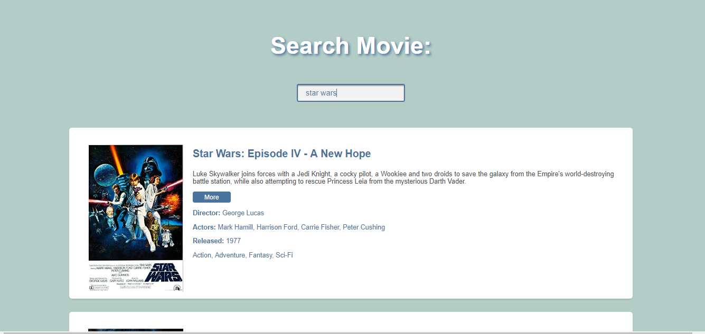

# Movies-Searcher-from-Restful-API

A small web app project which returns movie results from user queries. Used HTML, CSS, JS and the OMDB api(which provides a free api).
Made mostly to understand asychronous js calls and their various implementations (in ES6 mostly, but in previous iterations as well).

Very easy to use, just type in your query and after a 3 seconds the results will start appearing.
